# TesserCAD

**A free, open-source CAD studio that runs entirely in your browser.**
Parametric 3D solid modelling, 2D drafting, and 4D — three dimensions plus time — simulation.
No installation, no account, no server. Your model never leaves your machine.


> **▶ Live app:** https://samuelhtampubolon.github.io/Portofolio_Tutorial/
>
> Published automatically by the [deploy workflow](../../actions/workflows/pages.yml) on every
> push to `main`.

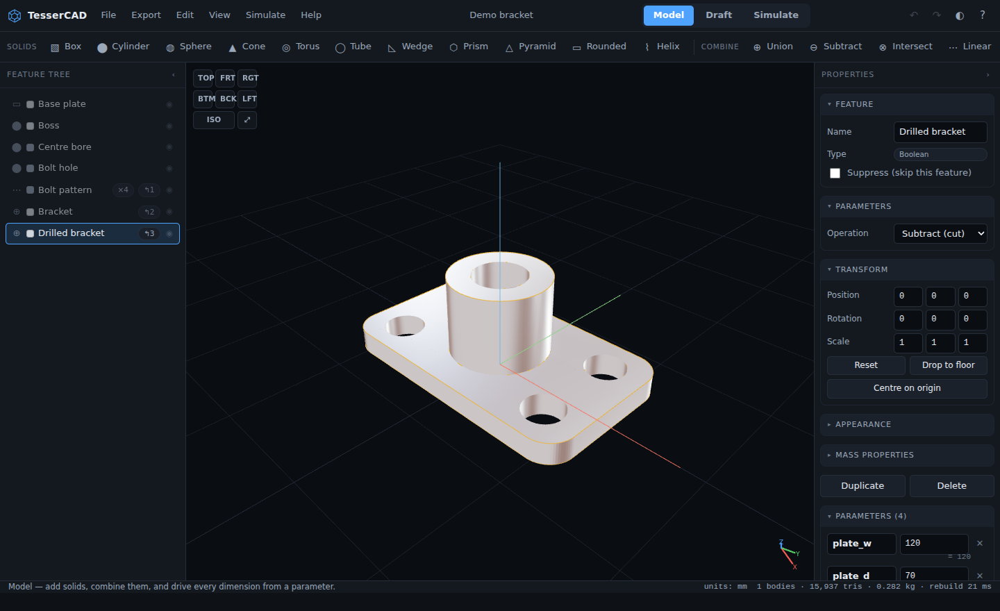

---

## What it is

TesserCAD is an attempt at the parts of SolidWorks and AutoCAD that most people actually
reach for, rebuilt as a single static web page:

| | SolidWorks-style | AutoCAD-style | The fourth dimension |
|---|---|---|---|
| **Workspace** | **Model** | **Draft** | **Simulate** |
| Parametric feature history | ✔ | | |
| Solid primitives + booleans | ✔ | | |
| Extrude / revolve a sketch | ✔ | ✔ (draw it here) | |
| Patterns, mirror, transforms | ✔ | ✔ | |
| Layers, object snap, dimensions | | ✔ | |
| DXF / SVG exchange | | ✔ | |
| Timeline, keyframes, easing | | | ✔ |
| Construction sequencing (4D BIM) | | | ✔ |
| Rigid-body dynamics & motors | | | ✔ |
| Video capture of the animation | | | ✔ |

Everything is driven by **named parameters**. Type `plate_w / 2 - clearance` into any
dimension field and the whole model rebuilds when the parameter changes — that is what makes
it CAD rather than a 3D drawing program.

## The interface

188 commands, reachable five ways — and every one of them is generated from a single registry,
so nothing can drift out of sync:

| Surface | What it gives you |
|---|---|
| **Menu bar** | 13 menus — File, Edit, Create, Modify, View, Measure, Draft, Simulate, Export, Window, Studio, Analyse, Help — with submenus, live checkmarks and shortcut hints |
| **Ribbon** | A contextual toolbar that changes per workspace, grouped and labelled, with commands greying out when they don't apply |
| **Command palette** | `Ctrl K` — ranked fuzzy search over everything, with your recent commands first |
| **Quick menu** | `Q` — eight numbered favourites at the cursor, different per workspace |
| **Context menus** | Right-click a body or a tree row for exactly the operations that apply to it |

Plus a **preferences dialog**, an **undo-history browser** you can jump around in, six **starter
templates** that are all real parametric models, and an optional **learning card** that tracks
the eight things worth trying first.

## Studio: the part that thinks about the design with you

<table>
<tr>
<td width="33%">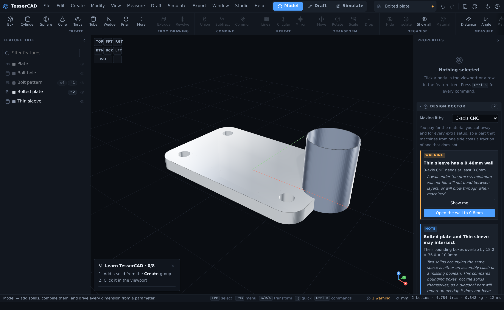</td>
<td width="33%">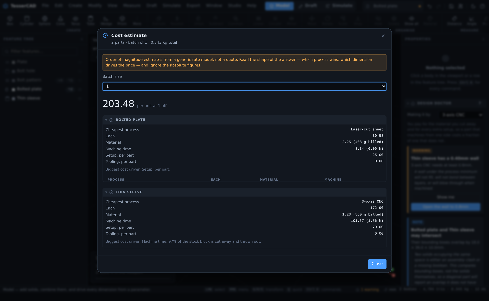</td>
<td width="33%">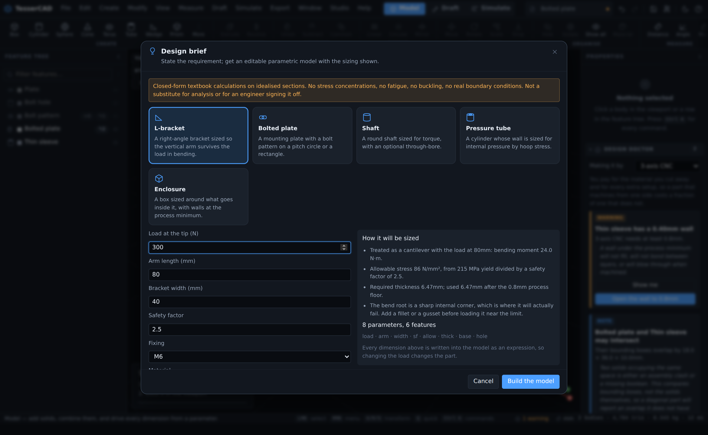</td>
</tr>
</table>

Most of what CAD asks of you is not modelling. It is knowing whether the thing you drew can be
made, what it will cost, what you decided last time, and assembling the eleven files somebody
downstream actually needs. TesserCAD does that work in the app rather than leaving it to you:

### The Design Doctor runs continuously, and repairs what it can

Sixteen checks run after **every** rebuild, not when you remember to ask, and each finding
carries three things a bare error message never does — what is wrong, why it matters, and where
possible a one-click repair.

- **Manufacturability against the process you actually named.** A 0.4mm wall is fine in moulded
  ABS and impossible in sand casting, so the checks ask what you are making it by first. Walls,
  minimum features, work envelope, material-process compatibility.
- **Geometry that will fail downstream**: open shells that are not watertight, bodies that
  intersect, a model that is 1000× too small because a unit got lost on import.
- **Intent that has gone missing**: a parameter that drives nothing, a model that is all raw
  numbers while carrying named parameters, two parts with the same name heading for one BOM row.
- **Repairs that keep the intent.** A boolean whose inputs were deleted is not just reported;
  the diagnosis says *why* it broke and offers to reconnect it, unsuppress the input that was
  switched off, relink a lost profile, or clamp a runaway pattern count. Nothing is ever
  repaired without you choosing it, and every repair is one undo.
- Where a check is an honest proxy rather than an exact analysis — interference compares
  bounding boxes, not solids — **the finding says so in its own text**, so you are never
  misled about what has been verified.

### Cost, not just manufacturability

A part can be perfectly manufacturable and still be a bad part. The estimate compares every
process that suits the material *and the shape*, and answers the question a per-part price
cannot: **where the cheapest process changes as the quantity grows.**

It knows that machining is billed on the block you start from — so a hollowed-out part gets
*dearer* — and it tells you which single number is driving the price. These are
order-of-magnitude figures from a generic rate model, and the interface says so everywhere it
shows one; the value is the shape of the answer, which survives the rates being wrong by a
factor of two.

### Start from a requirement, not a rectangle

**Design brief** takes what you actually know — a 300N load at 80mm, M6 fixings, aluminium —
and sizes the part from first principles, then writes the sizing into the model *as
expressions*, so `thick = sqrt(6 * load * arm / (width * allow))` and doubling the load moves
the geometry. Five archetypes: L-bracket, bolted plate, shaft, pressure tube, enclosure.

There is no language model and no server here, and the app does not pretend otherwise: this is
closed-form engineering over a bounded catalogue, with every assumption listed and the caveat
written into the document itself rather than into a dialog you dismiss once.

### One command instead of eleven exports

**Release design** runs the checks first — a blocking finding stops the release, because
shipping is when an error costs the most — then packages STL, OBJ, DXF, SVG, a preview, the
BOM, the cost basis, the editable source and a README into a single ZIP, written by hand so
there is still no dependency.

It also carries **`design-intent.json`**: the parameters, the feature history, the
relationships and the material, in plain JSON beside the mesh. An STL is geometry with the
reasoning stripped out; this is the reasoning, written down next to it.

### Analyse: the numbers, computed rather than estimated

<table>
<tr>
<td width="50%">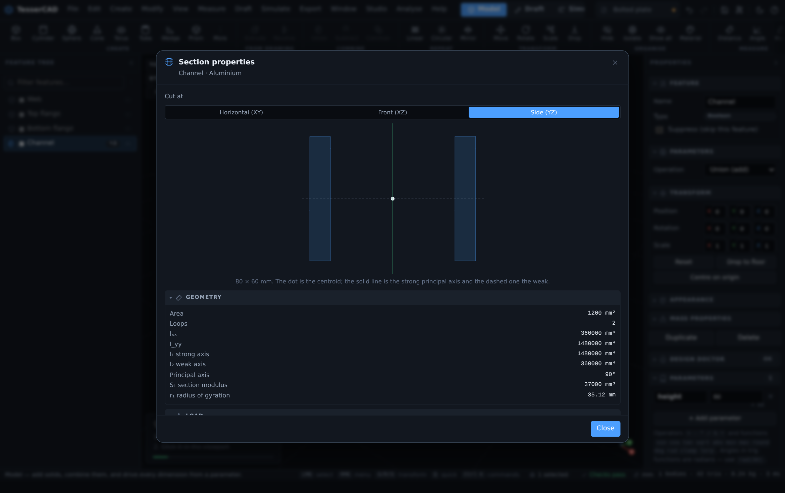</td>
<td width="50%">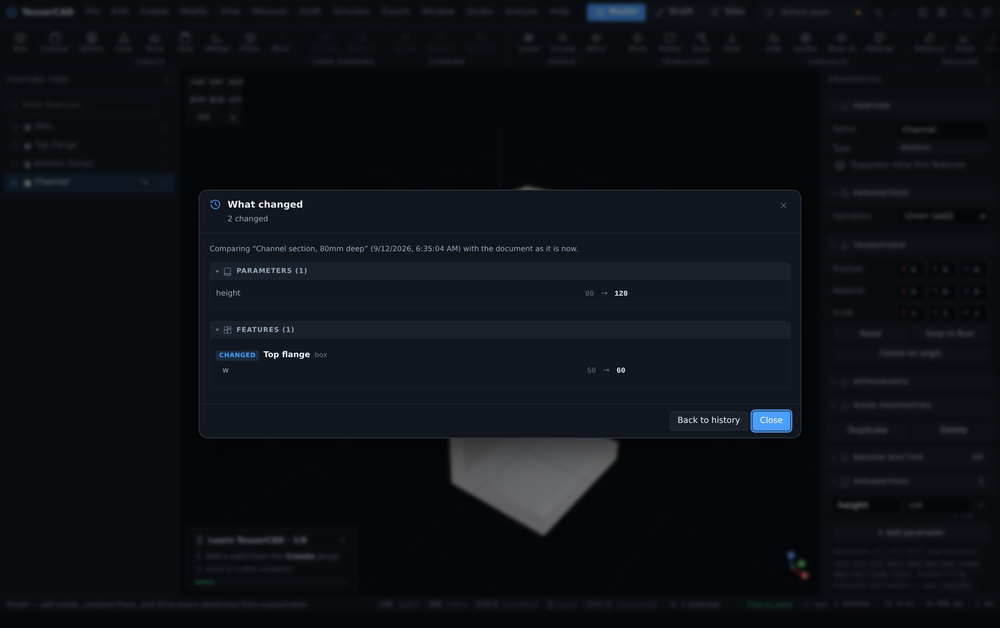</td>
</tr>
</table>

**Section properties.** "Is this strut strong enough?" is the question designers keep leaving the
application to answer, and the usual response — bolt on FEA — is both enormous and, for the shapes
most parts actually are, unnecessary. A beam in bending is governed by the second moment of area of
its cross-section, and that is not an estimate: it is an exact property of the geometry.

So TesserCAD slices the body, recovers the true cross-section, draws it to scale with its principal
axes, and computes what a structures textbook would: area, Iₓₓ / I_yy / Iₓᵧ, principal moments,
section moduli, radii of gyration. Give it a load case and it reports the bending stress and the
utilisation against yield. Hollow sections need no special handling: an interior loop runs the other
way, so it subtracts itself.

It is checked against closed form — a rectangle to the last decimal, a tube to 0.04% — and it says
in the dialog, every time, that it is not FEA.

**Clash detection that is actually exact.** The first version compared bounding boxes, which is fast
and wrong: a diagonal strut reports a clash it does not have. The boolean engine the modelling
features already use will happily intersect two bodies and hand back the solid they share, so now
the answer is a measured volume and its centroid, not a suspicion. Boxes remain the broad phase,
and continuous checking gets a time budget so editing stays responsive.

**Reading an imported mesh.** A supplier's STL is eighty thousand triangles with no feature tree,
and the job is to move one hole. Reconstructing the modelling operations is a research problem;
*measuring* is not. Triangles are grouped into patches across edges that are not creases, so a
tessellated cylinder is one patch rather than 48 facets. A patch whose normals agree is a plane; a
patch whose normals are all perpendicular to a common direction is a cylinder, and that direction
is recovered as the smallest eigenvector of the normal covariance — so **a hole drilled at 30° is
found with its axis to within 0.000°**, not just one down Z. Inward-facing means a hole, outward
means a boss, and roundness is reported rather than hidden.

Then the payoff: press a button and the measured hole becomes a real parametric cut at exactly its
position and diameter, which you can move, resize and drive from a parameter.

An earlier version of this fitted circles to boundary loops, and a test caught it claiming the
rectangular side facets of a cylinder wall were holes. They were: a rectangle's four corners really
are equidistant from its centre.

### Configurations, version control and export that respects tolerance

**Configurations** put every size of a part in one file. A configuration stores only the parameters
it overrides, so a change to the shared design reaches all six variants instead of being applied six
times — and switching writes into `doc.params`, which means the expression engine, the inspector,
the Doctor and the cost model need no knowledge of configurations at all.

**Local version control.** The software world settled this thirty years ago and CAD never got the
benefit; the options are a filename convention or a vendor's server that wants a check-in to rotate
a bolt. Neither is necessary, because a TesserCAD document is plain JSON at every instant. So there
are snapshots, branches and a **real structural diff** — not "the file changed" but
`plate_w 140 → 180, added Bolt hole, count 4 → 6`. Features are matched by id first and by name
second, so a rename reads as a rename rather than a delete plus an add.

**Export at a stated tolerance.** Segment counts are set per feature at modelling time, when what
matters on export is the tolerance of the thing being exported. So export has its own policy in the
language engineers already use: chord tolerance. "No point on this mesh is more than 0.05mm from the
surface it represents." A 3mm bolt hole and a 200mm flange each get exactly the segments they need
and no more — and the tolerance is written into the release package, because a mesh without its
tolerance is a number without a unit.

### Memory, automation and a tutor that explains why

- **Studio standards** are the settings you should only have to give once: units, material,
  your shop's real minimum wall, your rates. They seed new documents and are what the Doctor
  measures against. Alongside them is a **decision log** — what was chosen and why — which
  outlives any single file.
- **Macros** record a run of commands and replay it as *one undo step*. No Python, no API: the
  command registry means recording is just remembering which ids went past. Commands that open
  a picker are refused at record time rather than stalling a replay.
- **The why-tutor** takes over the learning card once the eight-step tour is done, and explains
  the engineering reason behind whatever the model is currently doing — why boolean order
  matters, why a lighter machined part costs more, what a safety factor is actually covering.
  A live Doctor finding always outranks a general lesson, and a lesson never fires twice.

Everything above stays in the browser. No account, no upload, no network call.

### On a phone

Below 700px the desktop chrome is replaced rather than shrunk, because a menu bar that vanishes
and 27px controls are not a mobile interface:

<table>
<tr>
<td width="33%">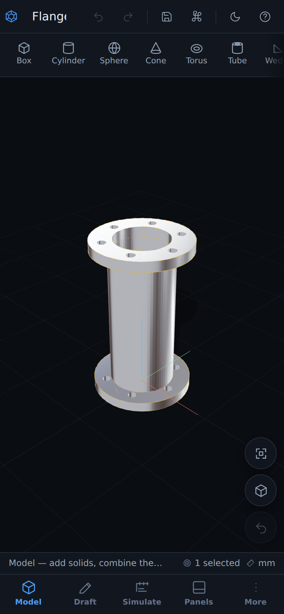</td>
<td width="33%">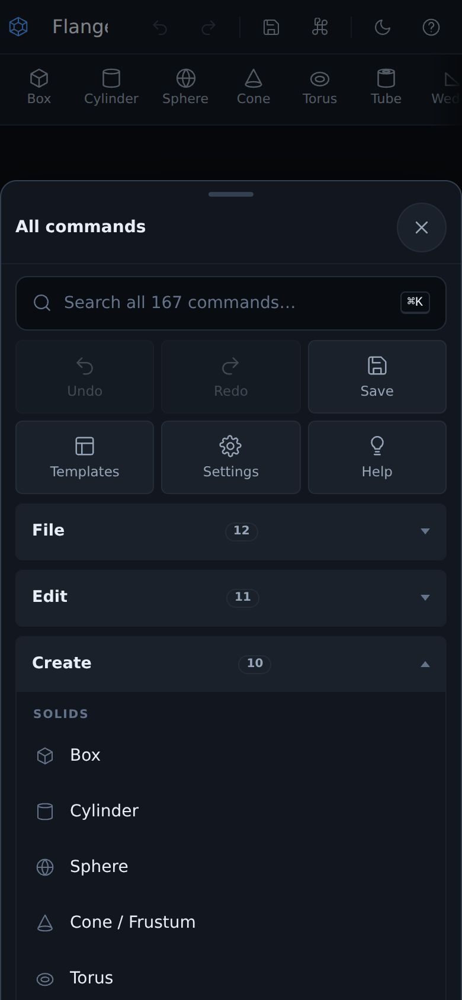</td>
<td width="33%">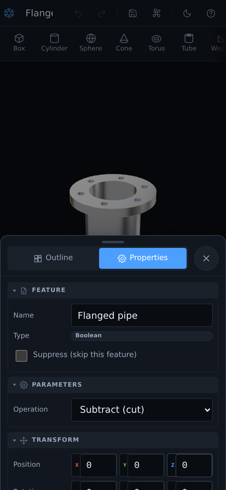</td>
</tr>
</table>

- **Bottom navigation** — the three workspaces, Panels and More, all in thumb reach.
- **Bottom sheets** host the *same* panel DOM as the desktop side panels, so nothing is a
  second-class copy. Drag the handle to resize between half and full height, or fling it away.
- **Every one of the 13 menus** is reachable from the More sheet, as accordions over 200-odd
  leaf commands, with a search row that opens the palette.
- **Long-press replaces right-click** in the viewport, the drawing and the feature tree.
- **Two-finger pan and pinch-zoom** in the Draft workspace, which has no wheel or middle button
  to fall back on. A drawing tool commits on lift, not on press, so the first finger of a
  two-finger gesture never leaves a stray point behind.
- **Every control clears 40px** and no input is under 16px, which is the threshold below which
  iOS Safari zooms the page on focus.
- Safe-area insets for notches and home indicators; a landscape layout that keeps the viewport
  usable.

### On a tablet

A tablet is a third problem, not a large phone or a small desktop. An iPad in portrait has the
width for a menu bar and a real side panel, just not for two panels beside a usable viewport:
280px each would leave about 200px of 3D, which is not a CAD viewport. So from 700px to 1279px
TesserCAD keeps the desktop chrome and docks **one** panel at a time.

<table>
<tr>
<td width="50%">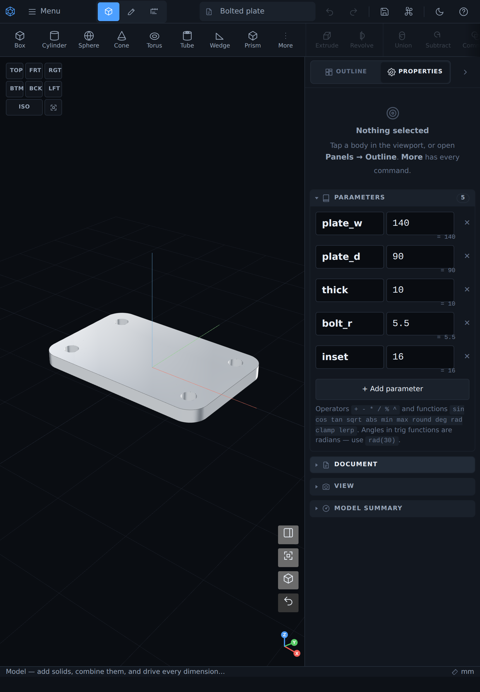</td>
<td width="50%">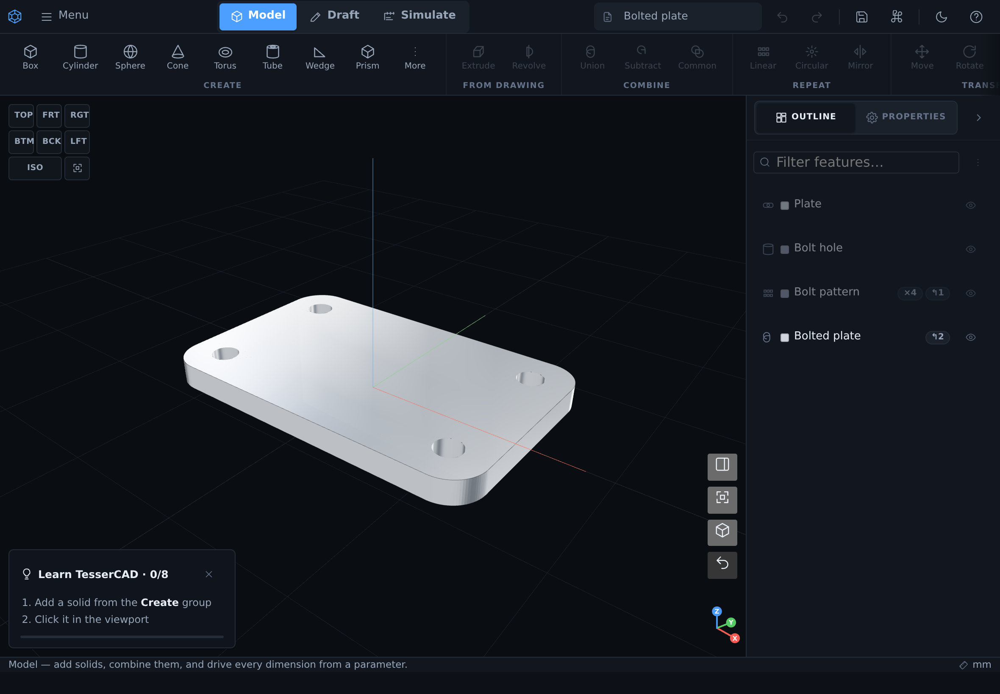</td>
</tr>
</table>

- **One dockable panel.** A segmented switch in the panel head swaps between Outline and
  Properties without changing the viewport width, so the model never jumps as you work. Your
  choice is remembered across sessions.
- **A collapse toggle in the floating cluster**, which is the only control that can bring the
  dock back once it is away — so it lives where your hand already is rather than in a menu.
- **The menu bar collapses to one button** holding the same eleven menus as submenus. Nothing
  is dropped and nothing scrolls off the right edge, which is what used to happen to the
  document chip and the theme and help buttons on an iPad in landscape.
- **Submenus open on tap.** A touch pointer cannot hover, so every parent row opens its submenu
  on the tap that lands on it, and tapping back into the parent menu does not dismiss it.
- **View controls come up as a popover** anchored to the cluster rather than as a bottom sheet:
  sheets are phone chrome and are styled only at that breakpoint.
- **Long-press replaces right-click** here too, and every visible control clears 28px.
- The `T` and `N` keys, the Window menu and the panel-head buttons all drive the same dock, so
  an attached keyboard behaves the way it does on the desktop.

### Three things it does better than the packages it imitates

**Modal transform operators.** Press `G`, `R` or `S` and the selection follows the pointer.
Press `X`, `Y` or `Z` to lock an axis; `⇧X` locks the perpendicular plane; type a number for an
exact value; `⇧` is precision, `Ctrl` snaps; `⏎` confirms and `esc` restores everything. No
dialog, no gizmo hunt, no mode switch — this is the single fastest editing model of the three
references, and TesserCAD brings it to a *parametric* modeller where the result lands back in
the feature tree as an editable dimension.

**Expressions everywhere, not just in a dimension dialog.** Every numeric field — parameters,
transforms, pattern counts, timeline values — takes `sqrt(area) * 0.5`. There is no separate
"equation editor" mode to enter and leave.

**Drag-to-scrub numbers.** Any number in the preferences and simulation panels can be dragged
sideways to change it live, `⇧` for fine and `Ctrl` for coarse, or clicked to type. Tuning a
value is a gesture, not a type-tab-commit cycle.

<table>
<tr>
<td width="50%">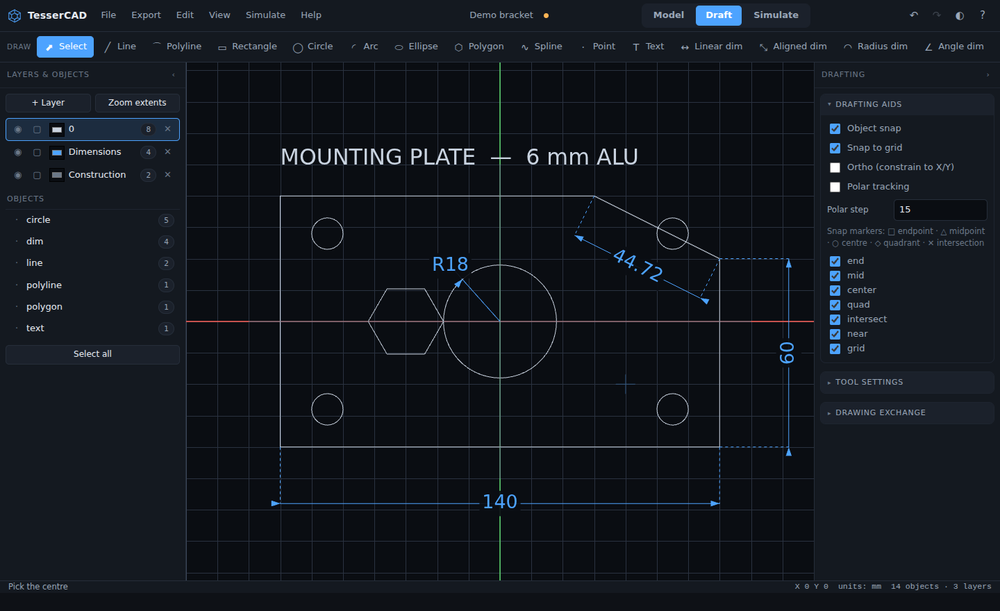</td>
<td width="50%">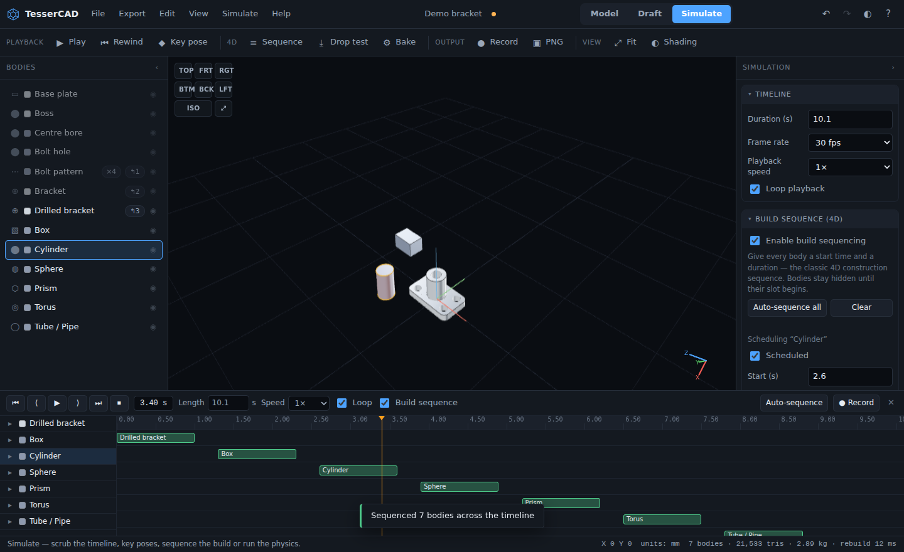</td>
</tr>
<tr>
<td><b>Draft</b> — snapping, layers and dimensions, ready to extrude.</td>
<td><b>Simulate</b> — the model assembling itself along a Gantt timeline.</td>
</tr>
</table>

## Highlights

**Modelling**
- 11 parametric primitives: box, cylinder, sphere, cone/frustum, torus, tube, wedge, prism,
  pyramid, rounded plate, helix/spring — each with partial sweeps where it makes sense.
- Real constructive solid geometry: **union, subtract and intersect** on closed meshes,
  implemented with BSP trees.
- **Linear and circular patterns** (up to 2 000 instances) and **mirroring** with correct
  winding, all as live history features.
- **Extrude** with draft angle, twist and midplane option; **revolve** with partial sweeps.
- A drag-to-reorder **feature tree**, per-feature suppression, visibility and materials.
- **Mass properties** — volume, surface area, centre of mass, bounding box and mass for
  15 built-in materials.
- Move / rotate / scale gizmos **and** modal `G`/`R`/`S` operators with axis locking and typed values.
- Align, distribute, drop-to-floor, centre-on-origin, isolate, hide/show, per-body materials.
- Section clipping, measuring tools, four shading modes, six starter templates.

**Drafting**
- Line, polyline, rectangle, circle, arc (3-point), ellipse, polygon, spline, point and text.
- Linear, aligned, radial and angular **dimensions** rendered with real arrowheads.
- **Object snapping**: endpoint, midpoint, centre, quadrant, intersection, nearest and grid,
  with ortho and polar tracking.
- **Typed coordinate entry** just like the AutoCAD command line: `50,30`, `@40,0`,
  `@60<30`, or a bare length along the cursor direction.
- Layers with colour, visibility, lock and line style.
- **DXF import and export** (AutoCAD R12 — readable by every CAD/CAM package), plus SVG.
- Any closed profile becomes a solid with one click.

**Simulation (the 4D part)**
- A real timeline: play, pause, scrub, step, loop, speed control, adjustable frame rate.
- **Keyframes** on eleven properties per body (position, rotation, scale, opacity,
  visibility) with eleven easing curves including bounce and elastic.
- **Build sequencing** — give every body a start time and duration and watch the model
  assemble itself. One click auto-sequences the whole tree. This is the classic 4D-BIM
  construction simulation.
- **Rigid-body dynamics** — gravity, restitution, friction, air drag, ground-plane and
  body-to-body collision, baked deterministically so scrubbing backwards always replays
  identically.
- **Analytic motors** for mechanisms: continuous spin, rotary oscillation, linear
  reciprocation and orbit.
- **Bake dynamics to keyframes** to hand-edit a physics result.
- **Record the timeline to video** (WebM) using the browser's own encoder.

**Files**
- Projects are plain JSON (`.tcad`) — diffable, scriptable, future-proof.
- Export **STL** (binary or ASCII), **OBJ**, **glTF/GLB**, **PLY**, **DXF**, **SVG**,
  **PNG** and a **bill-of-materials CSV**.
- Import **STL**, **OBJ**, **DXF** and `.tcad` — drag and drop onto the viewport.
- Autosave to local storage, with a 120-step undo history you can browse and jump around in.
- Preferences for theme, gizmo size, snap increment, edge angle and autosave interval.

## Getting started

Open the [live app](https://samuelhtampubolon.github.io/Portofolio_Tutorial/) and it loads a
demo bracket. Then:

1. **Model** — click the bracket, and on the right change `plate_w` from `120` to `180`.
   Everything downstream, including the bolt pattern, rebuilds.
2. **Draft** — press `R` for a rectangle and `C` for a circle inside it, select both,
   and press **Extrude →**. You now have a plate with a hole in the Model workspace.
3. **Simulate** — press **Sequence**, then space. The model builds itself along the timeline.
   Press **Drop test** to watch the same bodies fall under gravity instead.

Press `F1` for the full keyboard map, `Ctrl`+`K` for the command palette, or `Q` for the
quick menu.

There is a longer walkthrough in **[docs/USER-GUIDE.md](docs/USER-GUIDE.md)**.

## Running it locally

The app is static ES modules with no build step. Any static file server works:

```bash
git clone https://github.com/samuelhtampubolon/Portofolio_Tutorial.git
cd Portofolio_Tutorial
npm run serve          # or: python3 -m http.server 8080
# open http://localhost:8080
```

Opening `index.html` straight off the disk (`file://`) will **not** work, because ES modules
and import maps require an HTTP origin. Any local server is fine.

### Tests

```bash
npm test
```

This runs 58 headless assertions over the expression evaluator, the CSG kernel, the geometry
builders, the rebuild engine, the DXF codec, the starter templates and the command registry. It shims `node_modules/three` from the
vendored copy first; nothing is downloaded.

## Deploying your own copy

1. Fork this repository.
2. **Settings → Pages → Build and deployment → Source: GitHub Actions.** This one-time toggle
   cannot be automated: creating a Pages site needs repository-admin rights, and a workflow's
   `GITHUB_TOKEN` never has them. If GitHub offers to add a sample workflow during that step,
   decline it — this repository already has one, and a second workflow in the same
   `concurrency: pages` group just cancels the first at random.
3. Push to `main`. The [workflow](.github/workflows/pages.yml) runs the tests and publishes.

That is the whole deployment: free hosting, public URL, no server to run. Pages is free on
public repositories; a private fork needs a paid plan. The app is a static
site, so it works equally well on Netlify, Vercel, Cloudflare Pages, or any web host you can
copy files to.

## How it works

```
index.html            import map + the application shell
styles/app.css        design tokens, light & dark themes, responsive layout
vendor/               three.js r169 and its addons, vendored (MIT)
src/
  core/
    bus.js            a tiny event bus — the only coupling between modules
    expr.js           safe arithmetic evaluator (no eval) for parametric fields
    doc.js            document model, feature catalogue, undo/redo, autosave
    csg.js            BSP-tree constructive solid geometry
    geometry.js       Z-up primitives, profile extraction, extrude, revolve
    rebuild.js        the feature-evaluation engine, caching and mass properties
  view/viewport.js    WebGL viewport: cameras, lighting, picking, gizmos, clipping
  draft/
    draft.js          the 2D drafting board (Canvas2D), tools, snapping, dimensions
    dxf.js            DXF reader/writer and SVG writer
  sim/
    sim.js            the 4D engine: schedule, keyframes, dynamics, motors
    recorder.js       canvas → WebM video capture
  io/io.js            import, export, project save/load
  intel/
    process.js        manufacturing processes: limits, envelopes, rates
    section.js        exact cross-section properties, and stress from them
    interfere.js      exact clash detection, broad phase then boolean
    recognise.js      surface segmentation: planes, cylinders, holes
    configs.js        size variants sharing one feature tree
    history.js        local version control, branches and a structural diff
    tessellate.js     chord-tolerance export and mesh cleanup
    doctor.js         continuous validation and intent-preserving repairs
    cost.js           process comparison, crossover quantities, cost drivers
    brief.js          requirements to a sized parametric feature tree
    release.js        the deliverable package, and the design-intent sidecar
    zip.js            a stored-entry ZIP writer, ~120 lines, no dependency
    macros.js         record and replay commands as one undoable step
    standards.js      house standards, the decision log, macro storage
    why.js            the contextual engineering tutor
  ui/
    icons.js          146 inline SVG icons, one visual language, no icon font
    shell.js          menus, palette, quick menu, modals, toasts, form controls
    mobile.js         the phone shell and the tablet floating cluster
    commands.js       the command registry and the starter templates
    menus.js          menu-bar and ribbon layouts, generated per workspace
    operators.js      modal G/R/S transforms with axis locking and typed input
    tree.js           feature tree and layer list
    inspector.js      the context-sensitive properties panel
    timelineui.js     transport, tracks, keyframes and the 4D Gantt view
  main.js             the application controller: chrome, keyboard map, dialogs
tools/                dev shim + the headless test suite
```

Some decisions worth knowing about:

- **The world is Z-up**, matching mechanical CAD, not three.js' default Y-up. Primitives are
  rotated once at construction so every downstream consumer speaks the same language.
- **Lengths are always millimetres internally.** Units only change display and export.
- **The document is plain JSON at all times** — no class instances anywhere in it. That makes
  `structuredClone` a complete undo system and `JSON.stringify` a complete save format.
- **Rebuilds are cached per feature** by a content key that includes the resolved parameters
  and the keys of a feature's inputs, so editing one dimension only re-evaluates what depends
  on it.
- **Dynamics are baked**, not stepped live, so scrubbing the timeline backwards is instant and
  the simulation is reproducible frame for frame.
- **No `eval`.** Parametric expressions go through a hand-written tokeniser and
  recursive-descent parser that can only ever produce a number.
- **One command registry drives every surface.** The menus, ribbon, palette, quick menu,
  context menus and keyboard map are all generated from the same list, with live `checked`
  and `enabled` predicates — so a command cannot exist in one place and not another.
- **145 inline SVG icons**, no icon font and no sprite sheet: each is a path string drawn in
  `currentColor`, so icons inherit theme and state for free.
- **Layout comes from media queries, never from JavaScript.** A `MediaQueryList` change
  event is not reliably delivered in every engine, and a missed one would leave desktop chrome
  on a phone-sized screen. The classes JS sets (`phone`, `tablet`) are used only to decide
  *behaviour* — which sheet or popover a control opens — and never for anything visual.
- **Three tiers, one set of commands.** Phone (≤699px), tablet (700–1279px) and desktop
  (≥1280px) share the same command registry, the same panel DOM and the same keyboard map.
  `togglePanel` is the single place that knows which layout is live, so the `T` key, the
  Window menu and a panel-head button can never disagree about what a panel does.

## Honest limitations

It is worth being clear about what this is not, so you can decide whether it fits your work:

- **Mesh kernel, not B-rep.** Booleans operate on triangle meshes. There are no true fillets
  or chamfers on arbitrary edges, no NURBS surfaces, and no STEP/IGES exchange. Round corners
  are available as primitive parameters (the rounded plate, tube, torus and helix), not as an
  edge operation.
- **Boolean performance.** CSG is O(n log n)-ish on triangle count but constant factors are
  real; the engine refuses inputs above 90 000 triangles rather than freezing your tab. Lower
  the segment counts on the operands if you hit it.
- **Sketch constraints are not solved.** The Draft workspace gives you snapping, ortho, polar
  tracking and typed coordinates — not a geometric constraint solver, so no
  "make these two lines perpendicular and drive it from a dimension".
- **Collisions use bounding spheres.** That is the right tool for drop tests, packing studies
  and sequencing, and the wrong tool for precise contact mechanics. There is no FEA, no CFD
  and no stress analysis.
- **Assemblies are flat.** Bodies are a single ordered list; there are no sub-assemblies or
  mates. Patterns and booleans give you most of the structure you need in practice.
- **Video recording depends on the browser's encoder** (`MediaRecorder`), so the output is
  WebM in Chrome and Firefox; Safari support varies.

Requires a browser with WebGL 2 and ES modules — Chrome, Edge, Firefox and Safari from
roughly 2021 onwards. The phone and tablet layouts are real interfaces rather than fallbacks,
but the modal transform operators and the 60-odd keyboard shortcuts need a keyboard, so serious
modelling is still faster on a desktop, or on a tablet with one attached.

## Contributing

Issues and pull requests are welcome. `npm test` must pass; the source has no build step and
no dependencies to install, so a clone and a static server is the whole development setup.

## About this repository

`Portofolio_Tutorial` is a portfolio repository; alongside TesserCAD it holds a set of
machine-learning Colab notebooks (`*.ipynb` in the root). They are unrelated to the CAD app
and are kept here as part of the same portfolio.

## Licence

MIT — see [LICENSE](LICENSE). Bundles [three.js](https://threejs.org) r169, also MIT.
